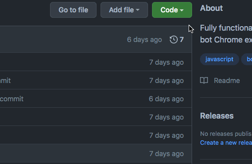
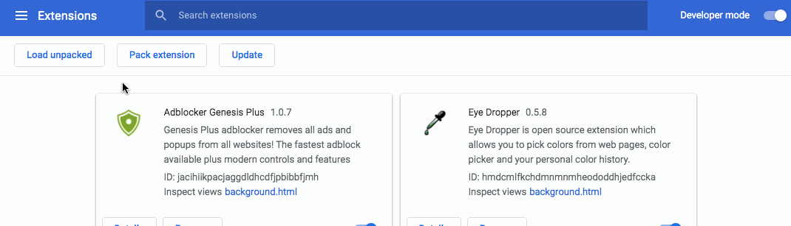

# OmegleChatBot

A chat bot that spams a particular message to hundreds of people within minutes.
More specifically, this bot takes the user's message, automatically sends it to a stranger on [omegle.com](https://omegle.com), disconnects from that chat session, and starts all over again.

# Why create this bot in the first place?

## This bot has many uses. To name a few:

1. Self-promotion (music/SoundCloud, art, Twitch, software, etc.)
2. Spreading information (doxxing, spreading a message/image)
3. Spreading social media links (SnapChat, Kik, etc.)
4. Growing a group/userbase (Discord)

# How to Install

## Manually install this extension into Chrome:

### 1. Download the zip from the GitHub repository:

### 2. Unzip the folder.

### 3. Go to "chrome://extensions" in Google Chrome:

### 4. Enable "Developer Mode":

### 5. Click "Load Unpacked" and select the unzipped "omegle-chat-bot" folder:

### 6. Visit [omegle.com](https://omegle.com) and start sending your messages!

## For more help, refer to [my LinkedIn post](https://www.linkedin.com/posts/mstephen19_javascript-project-video-activity-6846827501633855488-_tJj)

# Built With

* [HTML](https://developer.mozilla.org/en-US/docs/Web/HTML)
* [CSS](https://developer.mozilla.org/en-US/docs/Web/CSS)
* [Javascript](https://developer.mozilla.org/en-US/docs/Web/JavaScript)

# Author

**Matt Stephens**

- [Portfolio](https://mstephen19.github.io)
- [GitHub](https://github.com/mstephen19)
- [LinkedIn](https://www.linkedin.com/mstephen19)

## License

This project is licensed under the MIT License 

### Disclaimer

I, Matt Stephens, am not personally or legally responsible for any legal consequences that you could potentially face as a result of irresponsibly using this software.
Additionally, I am not responsible for any temporary or permanent bans put onto your IP address as a result of using this Chrome extension.
